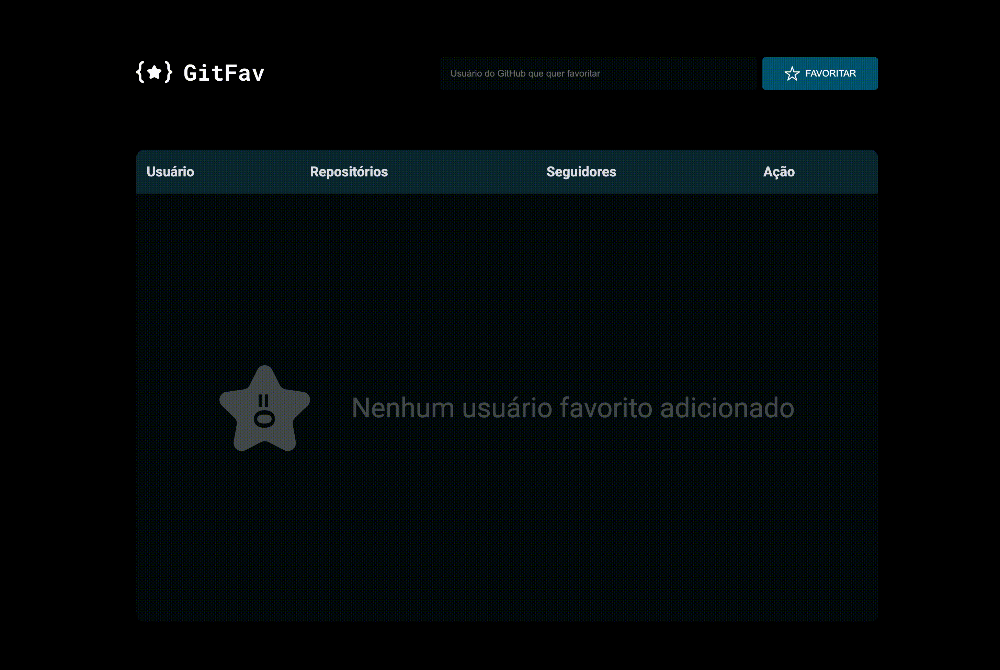

<h1 align="center"> GitFav </h1>

A single page application using the GitHub API to create a list of favorite users.  

  <a href="#-live-preview">Live Preview</a>&nbsp;&nbsp;&nbsp;|&nbsp;&nbsp;&nbsp;
  <a href="#-layout">Layout</a>&nbsp;&nbsp;&nbsp;|&nbsp;&nbsp;&nbsp;
  <a href="#-technologies">Technologies</a>&nbsp;&nbsp;&nbsp;|&nbsp;&nbsp;&nbsp;
  <a href="#-worked-on">Worked On</a>

 

  

 

## 📝 Live Preview 
- [English](https://dmm.studio/github/rocketseat/explorer/stage-06/gitfav/) - [repo](https://github.com/diegommagno/rocketseat/tree/main/explorer/stage-06/gitfav)
- [Brazilian Portuguese](https://dmm.studio/github/rocketseat/explorer/stage-06/gitfav/pt-br/) - viewing now

## 🎨 Layout

- [Link](https://www.figma.com/file/SzQA07HwmSPj4hOYgu1Pps/%5BDesafios-Explorer%5D-GitFav)

## 🧑🏻‍💻 Technologies

- HTML
- CSS
- JavaScript

## 🎓 Worked on

- API
- Tables
- Using classes 
- Modules
- Screen reader only elements
- Object oriented programming
- Async/Await
- Try, catch, throw
- Higher order functions (a function that takes a function as an argument, or returns a function)
- Immutability (an immutable value is one whose content cannot be changed without creating an entirely new value)