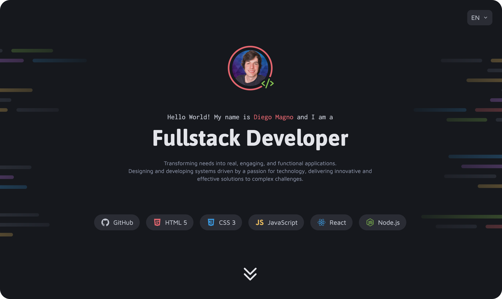

<h1 align="center">Dev Portfolio</h1>

A clean developer portfolio project focused on layout structure, component organization, and multilingual support using modern HTML, CSS, and JavaScript

  <a href="#live-preview">Live Preview</a>&nbsp;&nbsp;&nbsp;·&nbsp;&nbsp;&nbsp;
  <a href="#layout">Layout</a>&nbsp;&nbsp;&nbsp;·&nbsp;&nbsp;&nbsp;
  <a href="#technologies">Technologies</a>&nbsp;&nbsp;&nbsp;·&nbsp;&nbsp;&nbsp;
  <a href="#concepts-and-skills">Concepts and Skills</a>

 

  

 

<h3 id="live-preview">🌐 Live Preview</h3>

Access the deployed version of the project.

[Dev Portfolio](https://diegommagno.com/github/rocketseat/full-stack/stage-04/dev-portfolio)

 

  

 

<h3 id="layout">🎨 Layout</h3>

- View the design layout [here](https://www.figma.com/community/file/1387080701963671866).

 

<h3 id="technologies">⚙️ Technologies</h3>

- HTML5
- CSS3
- JavaScript

 

<h3 id="concepts-and-skills">📚 Concepts and Skills</h3>

- Modern semantic HTML structure (header, main, section, article, footer) focused on accessibility and SEO

- Scalable CSS architecture with modular files (global.css, utilities.css, components.css)

- Design system via CSS Custom Properties (:root) for colors, typography, spacing, and consistency

- Utility-first approach for colors and text styles to speed up development and maintenance

- Responsive layout strategies using max-width, fluid containers, and centered content

- Flexbox for alignment and component-level layouts (headers, cards, buttons, navigation)

- CSS Grid for the projects gallery

- Native CSS nesting (modern CSS) applied where it improves readability without overengineering

- SVG-first icons and illustrations using currentColor for full theme control

- Accessible interactive components, including:

  - Language switcher with ARIA attributes

  - Keyboard support (Escape to close)

  - Click-outside behavior

- Internationalization-ready project structure (i18n) with separate language routes (/en, /fr, /pt)
