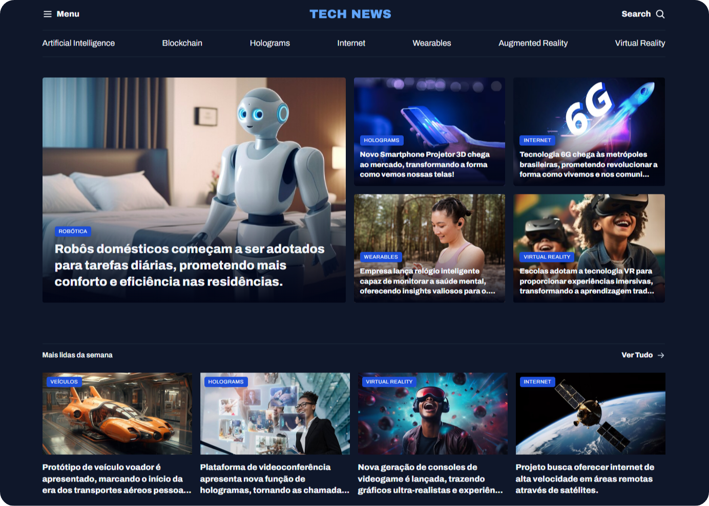

  

Projeto de um Portal de notícias desenvolvido durante as aulas de Grid na Rocketseat.

 

  <a href="#-live-preview">Live Preview</a>&nbsp;&nbsp;&nbsp;|&nbsp;&nbsp;&nbsp;
  <a href="#-technologies">Technologies</a>&nbsp;&nbsp;&nbsp;|&nbsp;&nbsp;&nbsp;
  <a href="#-layout">Layout</a>&nbsp;&nbsp;&nbsp;|&nbsp;&nbsp;&nbsp;
  <a href="#-worked-on">Worked On</a>

 

  

 

## 📝 Live Preview 

- [Travelgram Profile Page](https://diegommagno.com/github/rocketseat/full-stack/stage-03/travelgram)

 

  

 

## 🎨 Layout

- Check the layout [here](https://www.figma.com/community/file/1362166020452569562/portal-de-noticias). You will need a [Figma](https://figma.com) account to access it.

## 🧑🏻‍💻 Technologies

- HTML
- CSS

## 🎓 Worked on

- Responsive containers and layouts with `max-width` and `padding-inline`
- Custom properties using `:root` (`rem` units for scalability)
- `@import` to structure CSS into modular files (`global.css`, `nav.css`, etc.)
- Flexbox layouting for header, navigation, gallery, and footer
- Hover effects using `background-image` swapping (`MagnifyingGlass.svg`)
- Typography and spacing using variables like `--text-lg`, `--text-md`, etc.
