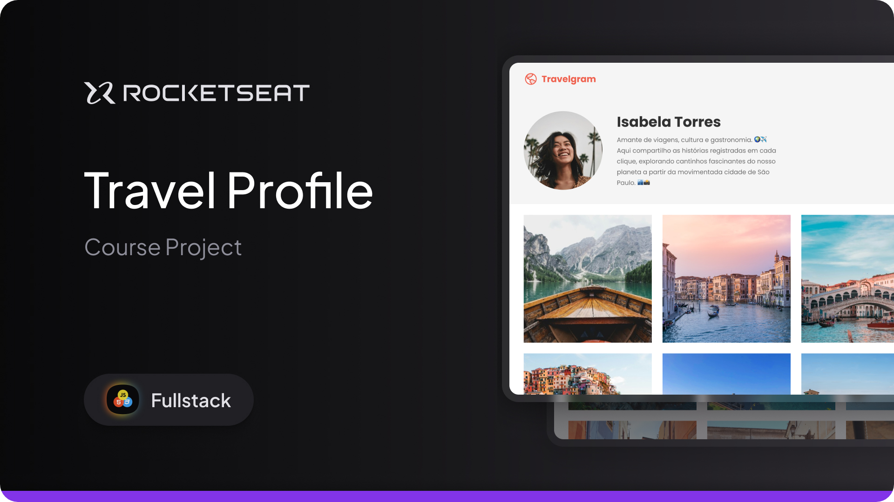

<h1 align="center"> Travelgram | Travel Profile Page </h1>

  Welcome to the Travelgram Profile Page! 🌍✈️  
   
   
  This project is part of the Full-Stack course from <a href="https://www.rocketseat.com.br">Rocketseat</a>.  
   
  It features a beautifully styled travel profile page showcasing a traveller's story, photo gallery, and travel statistics.  

  <a href="#-live-preview">Live Preview</a>&nbsp;&nbsp;&nbsp;|&nbsp;&nbsp;&nbsp;
  <a href="#-technologies">Technologies</a>&nbsp;&nbsp;&nbsp;|&nbsp;&nbsp;&nbsp;
  <a href="#-layout">Layout</a>&nbsp;&nbsp;&nbsp;|&nbsp;&nbsp;&nbsp;
  <a href="#-worked-on">Worked On</a>

 

  

 

## 📝 Live Preview 

- [Travelgram Profile Page](https://diegommagno.com/github/rocketseat/full-stack/stage-03/travelgram)

 

  

 

## 🎨 Layout

- View the design layout [here](https://www.figma.com/community/file/1360315496868719817/perfil-de-viagens).

## 🧑🏻‍💻 Technologies

- HTML
- CSS

## 🎓 Worked on

- Responsive containers and layouts with `max-width` and `padding-inline`
- Custom properties using `:root` (`rem` units for scalability)
- `@import` to structure CSS into modular files (`global.css`, `nav.css`, etc.)
- Flexbox layouting for header, navigation, gallery, and footer
- Hover effects using `background-image` swapping (`MagnifyingGlass.svg`)
- Typography and spacing using variables like `--text-lg`, `--text-md`, etc.
